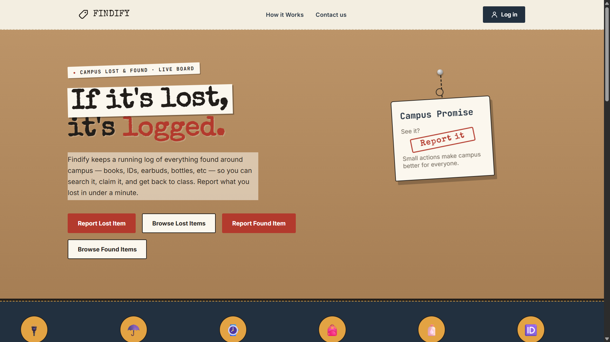
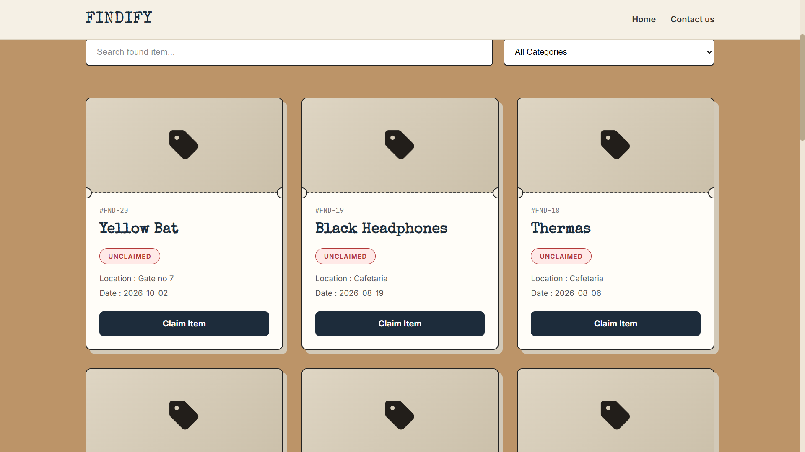
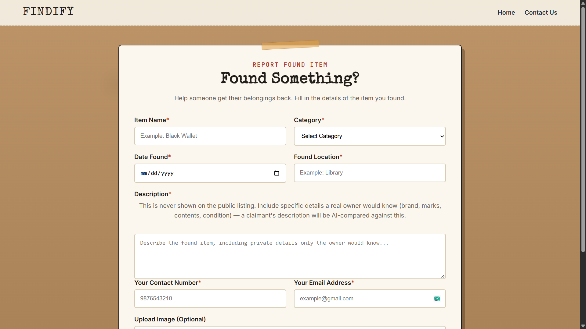
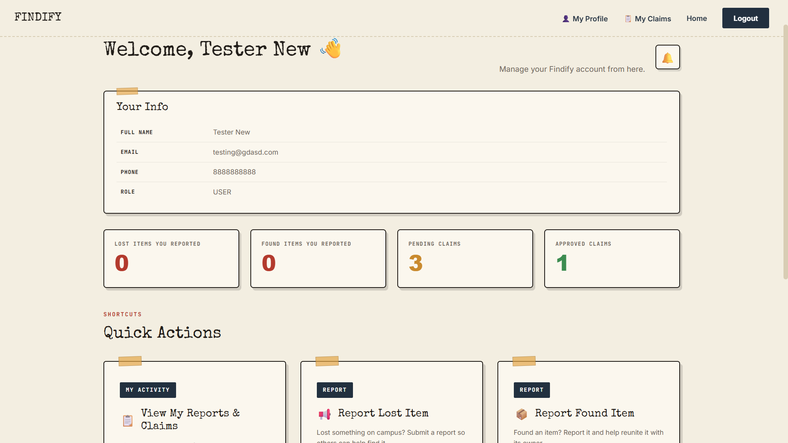
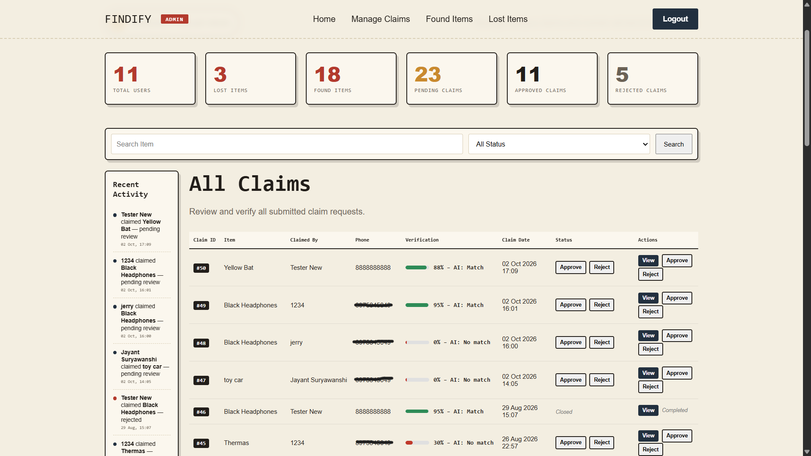
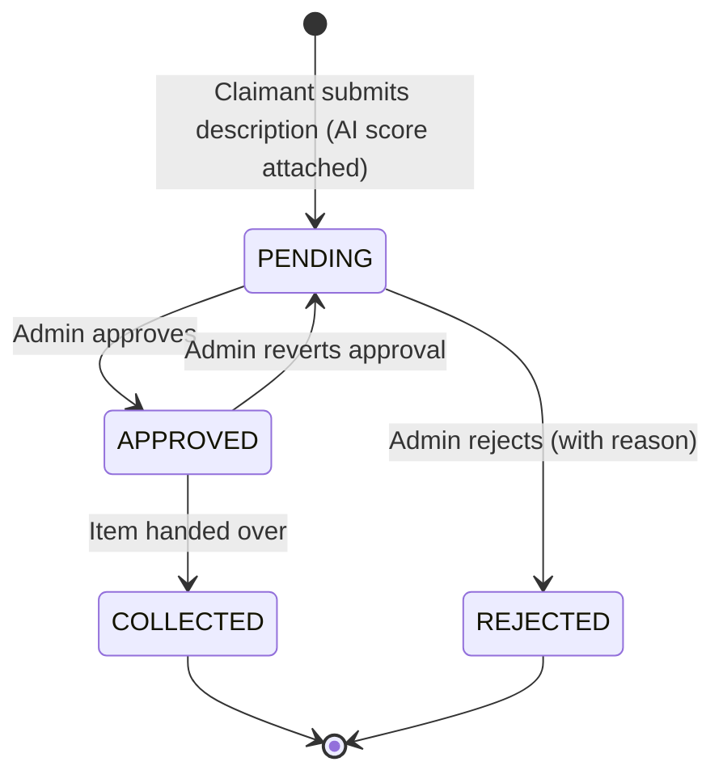

# Findify

**Lost it? Log it. Found it? Tag it.**

A campus lost-and-found web platform. Students report lost and found items, claim items they think are theirs, and an admin verifies every claim, with an AI-generated match score to help, before the item is handed over.


## Screenshots

| Home | Browse found items |
|------|--------------------|
|  |  |

| Report a found item | User dashboard |
|---------------------|----------------|
|  |  |

**Admin dashboard**



## Features

**For students**
- Register with **email OTP verification**; log in; reset a forgotten password through an OTP
- Report **lost** items and **found** items, with photo upload and categories
- Browse lost and found items with **search and category filters**
- **Claim** a found item by describing it, with guards against claiming your own item, a duplicate claim, or an item that is already closed
- Personal dashboard (your reports, pending and approved claims), in-app **notifications**, and account settings (change name, phone, password; delete account)

**For admins**
- Dashboard with live stats (total users, lost and found items, pending, approved and rejected claims), search and status filter, and a recent activity feed
- Review each claim and **approve**, **reject** (with a reason), **mark as collected** at handover, or **revert** an approval
- Approving a claim automatically closes competing pending claims for the same item, and every affected user is notified

**AI-assisted verification**
- When a claim is submitted, the finder's private description and the claimant's description are compared using the **Google Gemini API**
- It returns a match flag, a confidence score (0-100) and short reasoning, shown to the admin next to each claim
- The result is **advisory only**: every claim stays `PENDING` until a human admin decides

**Security**
- Role-based access (`USER` / `ADMIN`); admin actions are checked server-side
- Hardened image uploads: random UUID filenames, extension whitelist, MIME check, file-signature check, 5 MB limit
- Prepared statements (JDBC) for database access

## Claim lifecycle



## Tech stack

| Layer | Technology |
|-------|-----------|
| Backend | Java 17, Jakarta Servlets 6, JSP + JSTL |
| Database | MySQL 8 via JDBC |
| Frontend | HTML, CSS, JavaScript |
| Email | Jakarta Mail (Angus Mail) over Gmail SMTP |
| AI | Google Gemini API (`java.net.http`) |
| Build / Server | Maven (WAR), Apache Tomcat 10.1+ |

## Project structure

```
Findify_v1/
├── database/
│   ├── database.sql          # full schema + seed categories (new installs)
│   └── migration_v2.sql      # upgrade script for an existing v1 database
├── src/main/
│   ├── java/com/findify/
│   │   ├── model/            # User, LostItem, FoundItem, Claim, Notification, Dashboard
│   │   ├── dao/              # database access (one DAO per entity)
│   │   ├── servlet/          # 23 controllers (auth, reports, claims, admin, settings)
│   │   └── util/             # DBConnection, EmailUtil, GeminiMatcher, UploadUtil, TrustScoreUtil
│   └── webapp/               # JSP/HTML views, css/, js/, WEB-INF/web.xml
└── pom.xml
```

The app follows an MVC-style layout: JSPs render the views, servlets handle requests, DAOs talk to MySQL, and model classes carry the data.

**Database tables:** `users`, `categories`, `lost_items`, `found_items`, `claims`, `notifications`

## Getting started

### Prerequisites
- JDK 17+
- Maven 3.8+
- Apache Tomcat **10.1+** (the project uses the `jakarta.*` namespace)
- MySQL 8

### 1. Clone
```bash
git clone https://github.com/Pratyush-Tekale/Findify_v1.git
cd Findify_v1
```

### 2. Create the database
```bash
mysql -u root -p < database/database.sql
```

### 3. Set environment variables
Set these in the environment Tomcat runs in (for example in `bin/setenv.sh` / `bin/setenv.bat`, or in the Environment tab of your Eclipse server run configuration):

| Variable | Required | Description |
|----------|----------|-------------|
| `DB_PASSWORD` | yes | MySQL password |
| `DB_USER` | no | MySQL user (default `root`) |
| `DB_URL` | no | JDBC URL (default `jdbc:mysql://localhost:3306/findify_db`) |
| `MAIL_SENDER` | for OTP email | Gmail address used to send OTPs |
| `MAIL_APP_PASSWORD` | for OTP email | Google [App Password](https://support.google.com/accounts/answer/185833) for that account |
| `GEMINI_API_KEY` | for AI matching | Gemini API key. Without it, claims still work and just show "AI verification unavailable" |

Optional: start Tomcat with `-Dfindify.upload.dir=/path/to/uploads` to store uploaded images outside the deployed app.

### 4. Build and deploy
```bash
mvn clean package
cp target/findify.war $TOMCAT_HOME/webapps/
```
Start Tomcat and open **http://localhost:8080/findify/**

### 5. Create an admin account
Register a normal account through the app, then promote it:
```sql
UPDATE users SET role = 'ADMIN' WHERE email = 'you@example.com';
```

## Roadmap
- Hash passwords (BCrypt). Passwords are currently stored as entered, and this is the next planned security improvement
- CSRF protection on forms
- Move the Gemini model name and other settings into configuration
- Unit tests for the DAO and utility layers
- Live deployment

## Team

Findify was built by a team of three at **MES Abasaheb Garware College, Pune** (BCA Science). The design and UI were a joint effort by all three of us.

| Member | Contributions |
|--------|---------------|
| [Pratyush Tekale](https://github.com/Pratyush-Tekale) | Claim and collection workflow, admin dashboard and claim handling (approve, reject, collect, revert), Gemini API integration, key technical decisions |
| [Harsh Budhwani](https://github.com/harshbudhwani) | Lost and found item reporting, user registration with email OTP integration, notification system, account settings |
| [Sahil Kadam](https://github.com/sahil-kadam-07) | User dashboard, My Claims, and the user-side login and authentication flow |
